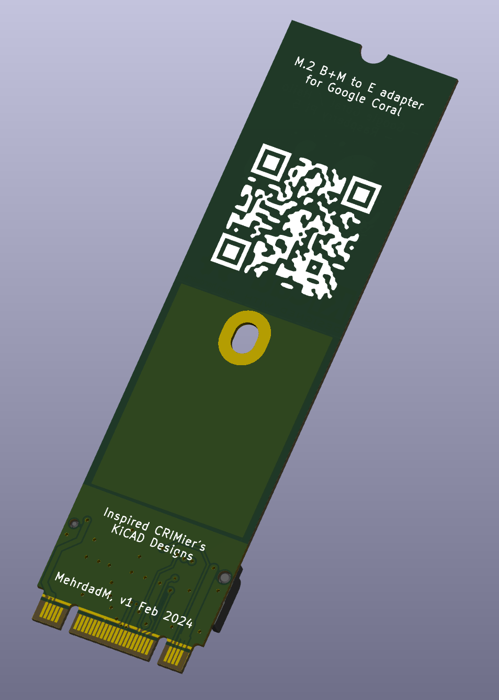
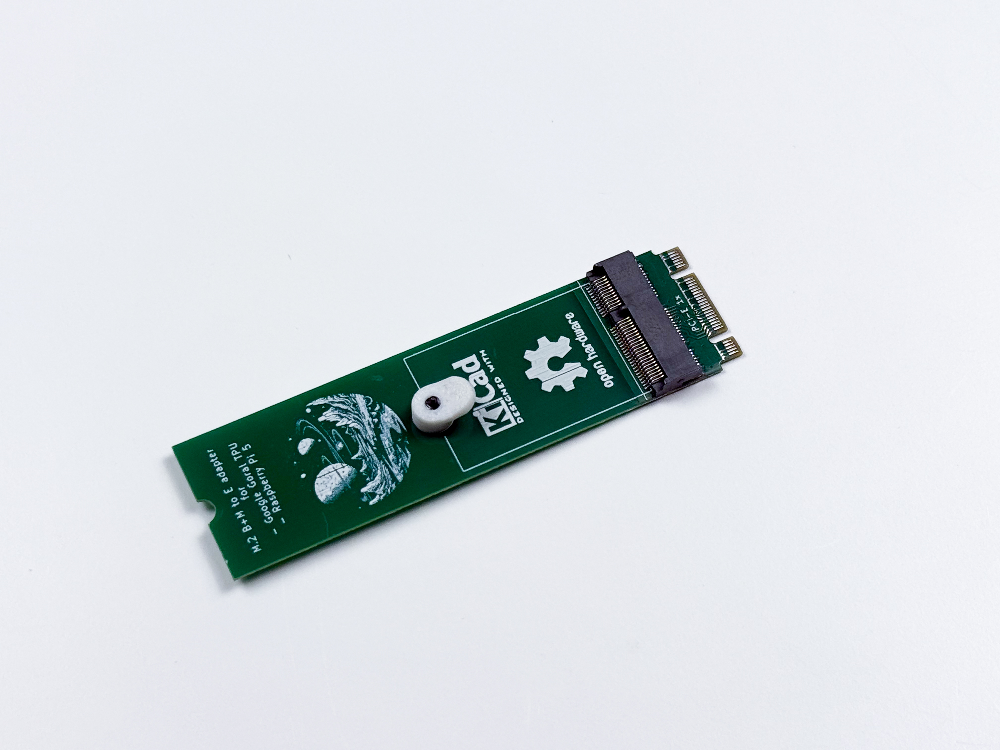
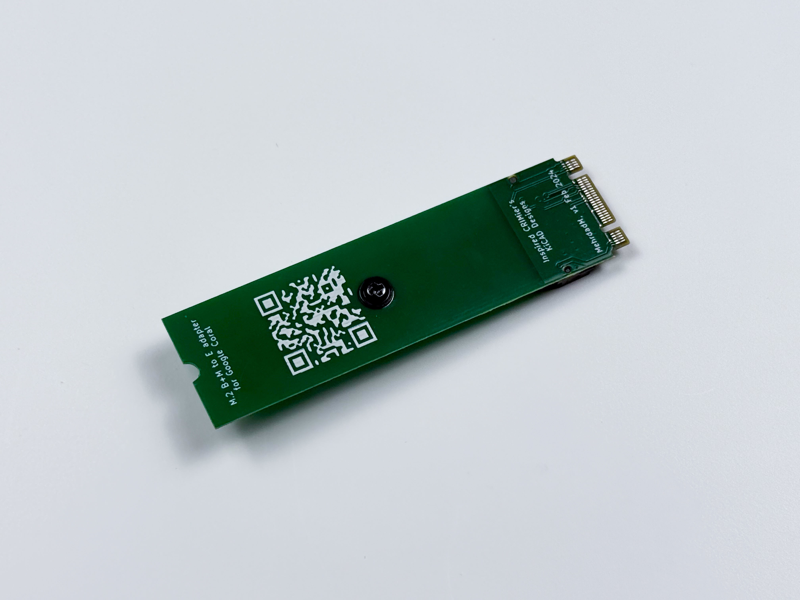
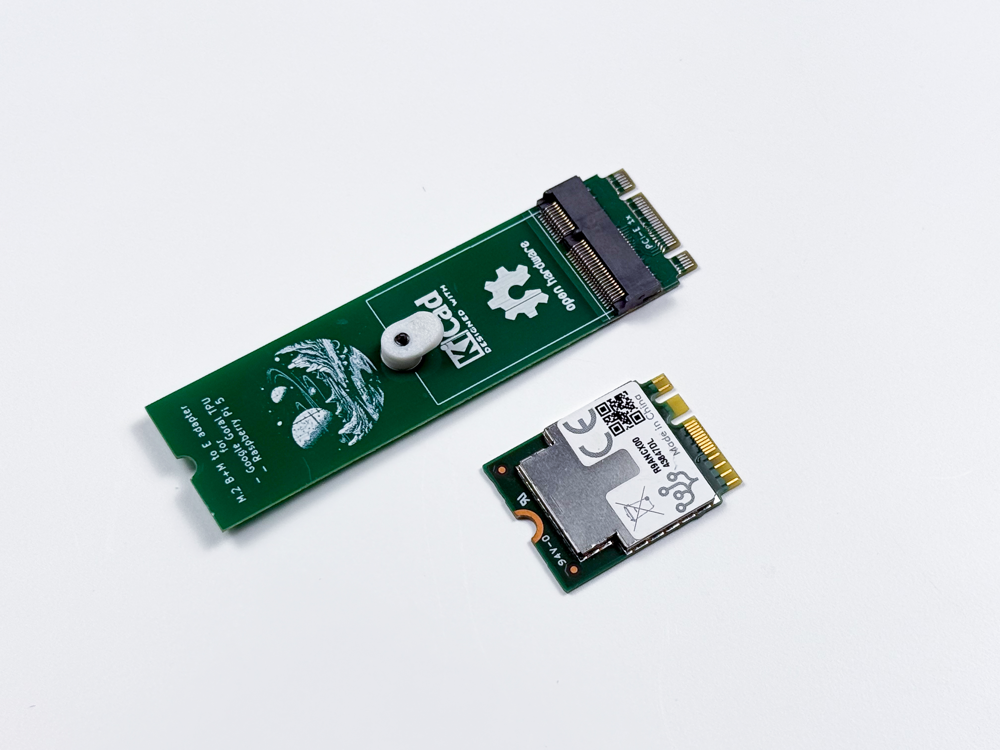
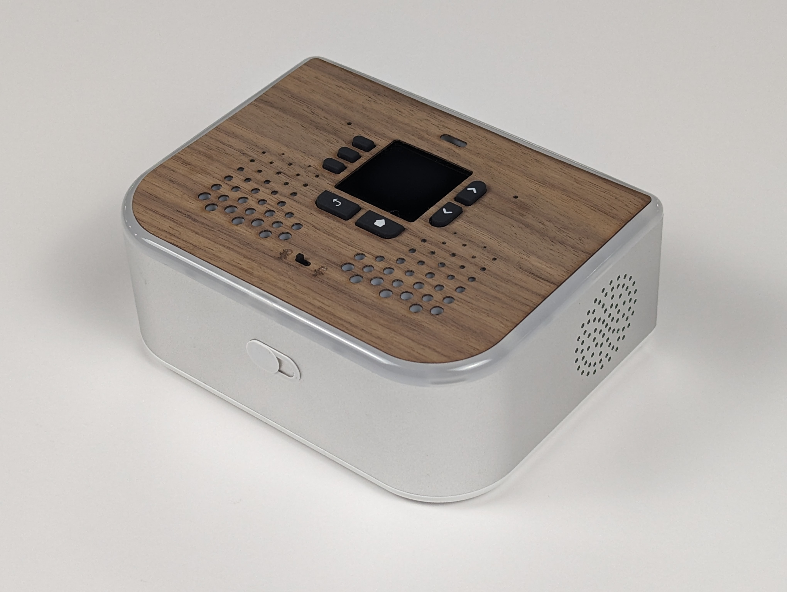
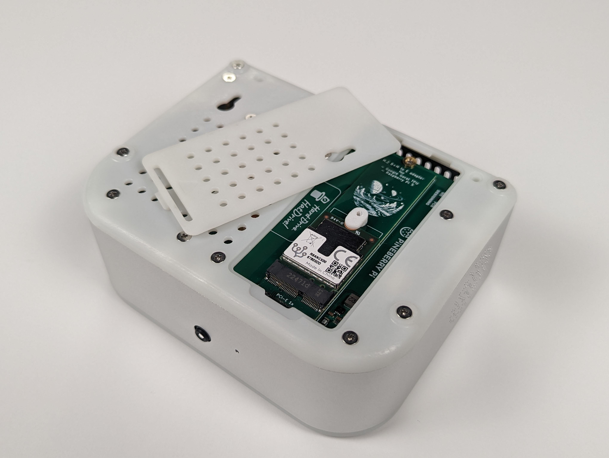

# M.2 M-key to A/E-key Adapter
## Supports Google Coral and other A/E key devices

<table>
  <tr>
    <td></td>
    <td></td>
  </tr>
</table>

<table>
    <tr><td></td></tr>
    <tr><td></td></tr>
    <tr><td></td></tr>
</table>

This design is used in [Ubo Pod](https://getubo.com) with a custom enclosure and quick access cover to reach NVMe drive or Google Coral accelerator. 

<table>
  <tr>
    <td></td>
    <td></td>
  </tr>
</table>
