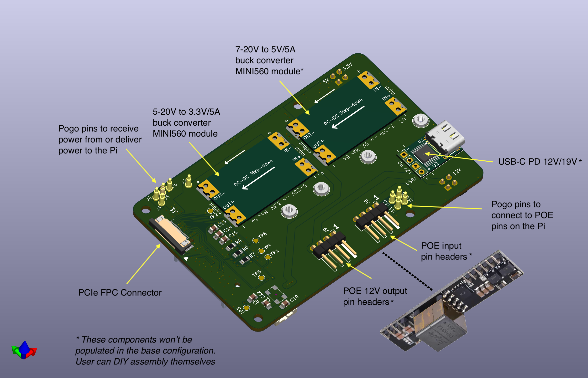
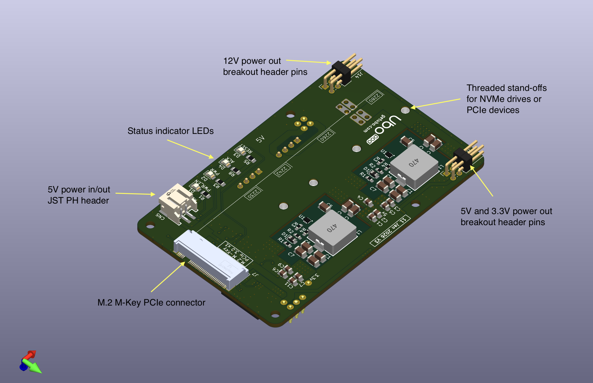
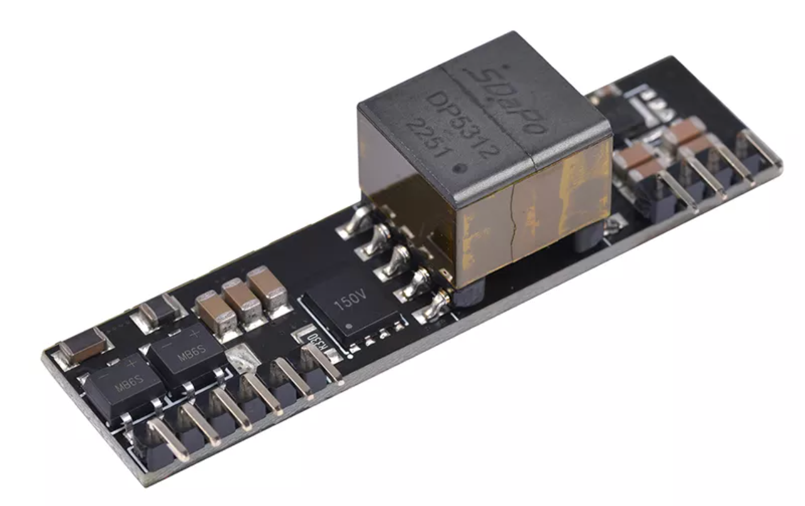

# Ubo HAB - PCIe/USB-C/POE+ adapter board for Raspberry Pi 5

This is a update to [Ubo PCIe HAB v1](https://github.com/ubopod/ubo-pcb/tree/main/KiCad/ubo-pcie-adapter) with several design enhancement and features:

<table>
  <tr>
    <td></td>
    <td></td>
  </tr>
</table>

1. PCIe to M.2 M-key adapter with SMD round screw nuts (support 2230/2242/2260/2280)
2. Support high wattage peripherals and drives (~15W)
3. Power pogo pins to either receive additional power from Raspberry Pi and power up the Pi via HAB (see power in options below)
4. DIY upgrade possible purchasing MINI560, USB-PD, POE+ modules separately
5. HAB can be powered via 
  + An optional USB-C PD module/add-on at 12v/3A (or 19v/3A)
  + An optional POE module/add-on  
6. Power output breakouts
  + 12V output breakout 
  + 5V output breakout 
  + 3.3V output breakout 

## Purchasing

I am planning to make a small batch of these boards and if you are interested in purchasing one, you can
make a reservation on my shopify store for $1 to help me better estimate how many units I should be ordering.

The base model (no USB-PD, 5V buck converter, and pin headers assembled) will be probebly priced around $20~$25. 

The fully populated model (USB-PD, 5V buck converter, all pin headers assembled) will be cost probably around $35~$40.

POE+ modules will be sold separately at around $20.

## Power modules

Power modules can be bought from Amazon or Aliexpress. The 3.3V and 5V modules used in the design are known as 
MINI560 modules and can provide up to 5A of output current. They also have castellated pads that made DIY soldering
a breeze. 

+ USB-C PD 12V module on Amazon
+ Mini360 5V step-down converter module on Amazon
+ Mini360 3.3V step-down converter module on Amazon

<table>
  <tr>
    <td></td>
    <td></td>
    <td></td>
  </tr>
</table>

## POE module

The HAB (Hardware added on the bottom) breaks out POE input pins and 12V return voltage from the POE module. 
The module can be purchased an connected separately using jumber wires to the exposed headers. 
The image below shows an example of such POE module. I am working to source some good quality modules and make them
available for purchase on my personal shopify page.

<table>
  <tr>
    <td></td>
  </tr>
</table>

This design can be used in [Ubo Pod](https://getubo.com) with a custom enclosure and quick access cover to reach NVMe drive or Google Coral accelerator.

