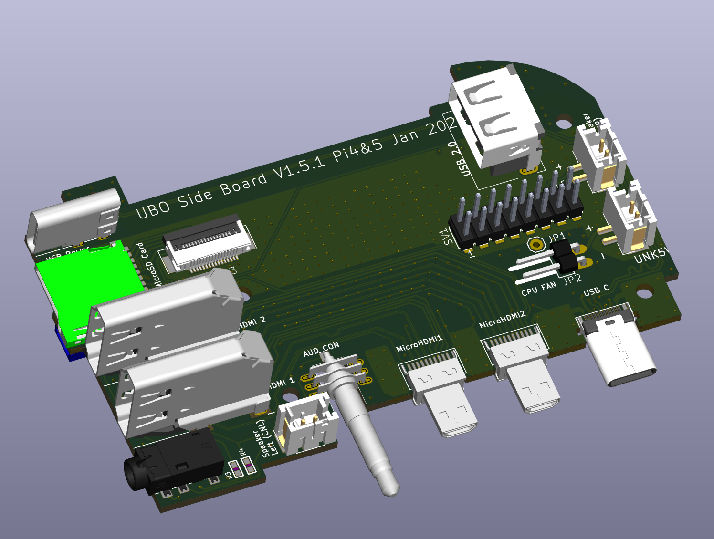
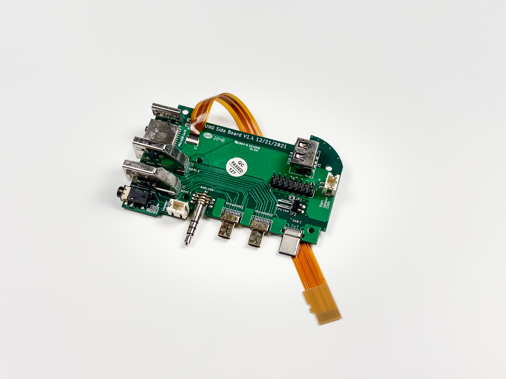
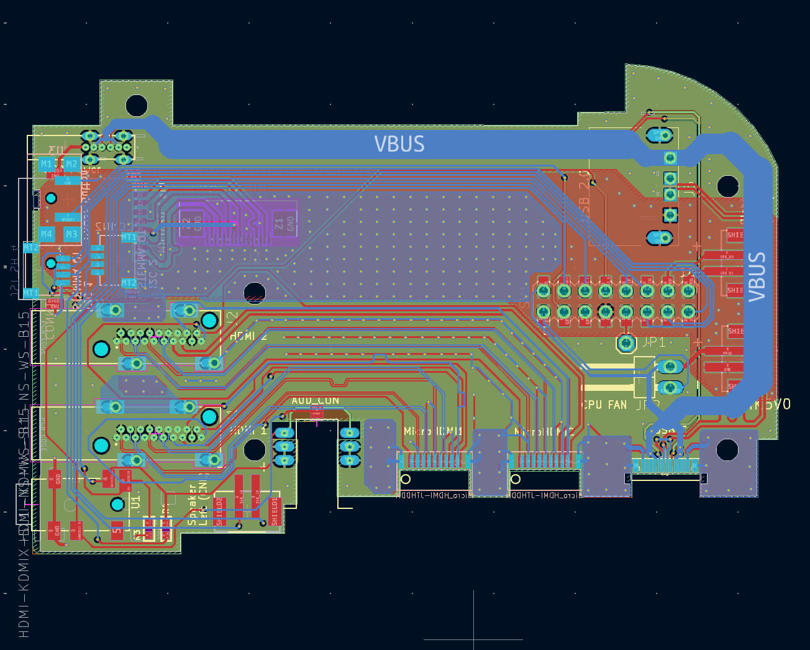
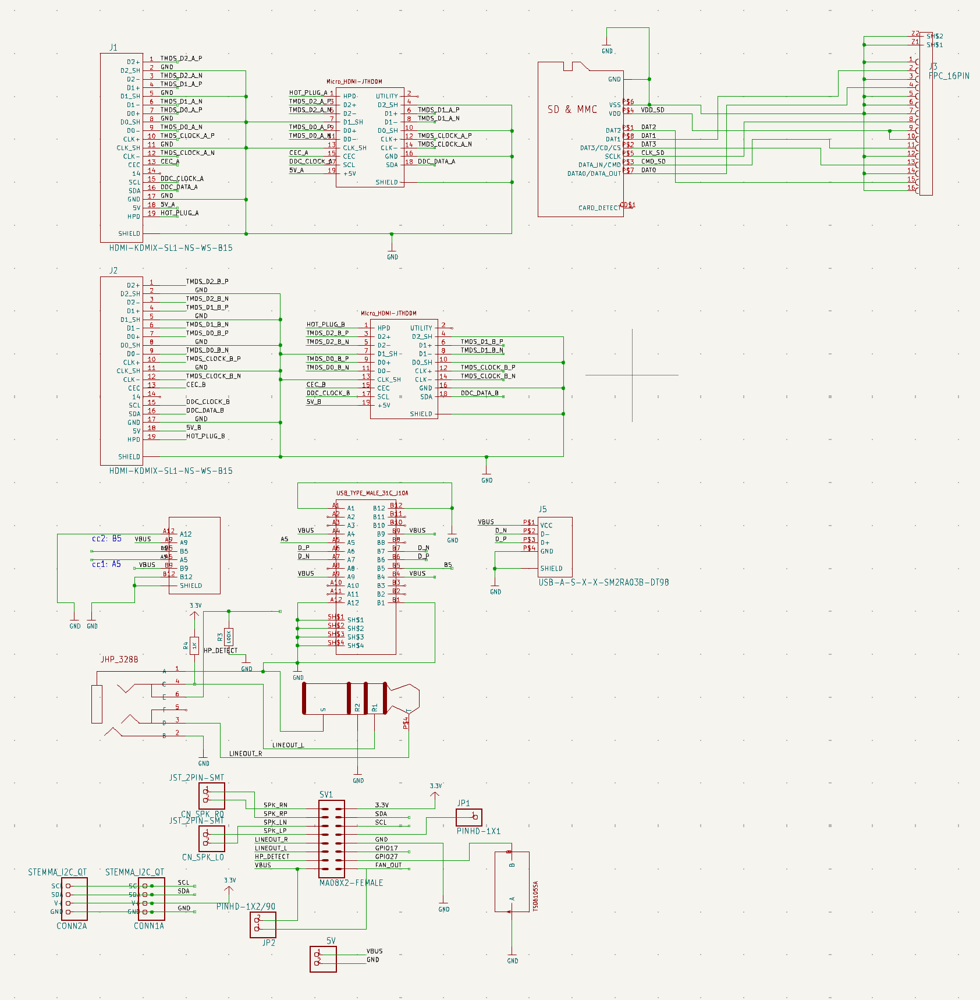

# Side Connector Board
This depo contain KiCad design files for PCB that connects to Raspberry Pi 4 and 5 side connectors, 
namely mini HDMIs, USB-C power, and audio jack (on Pi 4). The Pi 5 variant does not have the audio plug 
populated on the PCB since Pi 5 does not have an audio jack.

<table>
  <tr>
    <td></td>
    <td></td>
  </tr>
</table>

This design is used in [Ubo Pod](https://getubo.com) with a custom enclosure to arrange all the ports on the back:

## Features
- Mini HDMI to full HDMI conversion
- MicroSD card reader extender (brings the reader to the back)
- Audio jack insertion detection (via GPIO)
- Internal USB Type A connector that connects to data lines on USB-C
- 2 STEMMA Qt connectors (one internal and one external)
- Power button 
- Fan connector
- 2x8 Pin Header that connects to:
   - I2C pins
   - 3.3v and 5v pins
   - Right and left speakers
   - Audio line in (connects to audio jack)
   - Fan control
   - Power button
   - Audio insersion jack
   - 1 unused GPIO
 
## Layout

## Schematic

TODO:
- Add BOM
- Add stackup and manufacturing information
