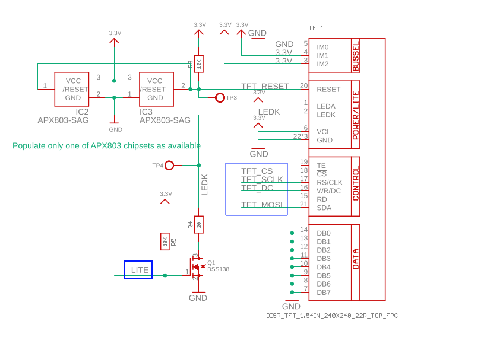
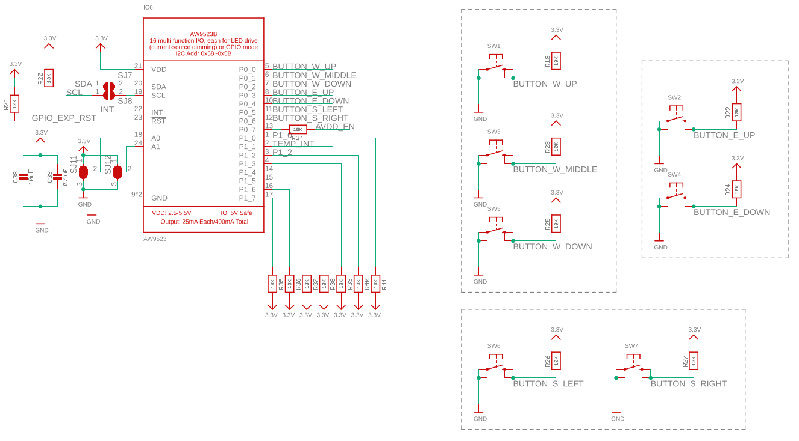
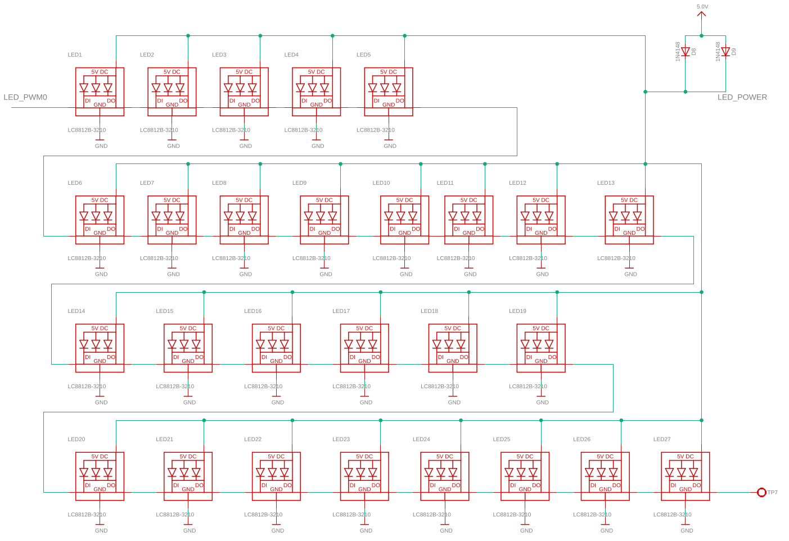
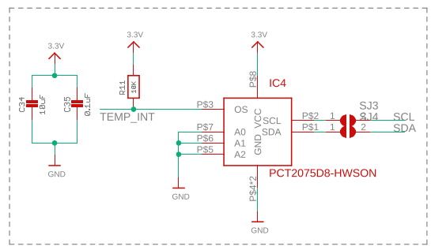
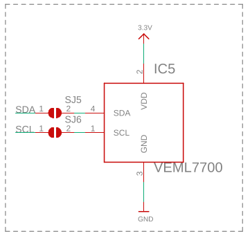
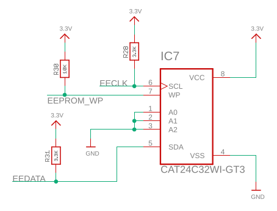
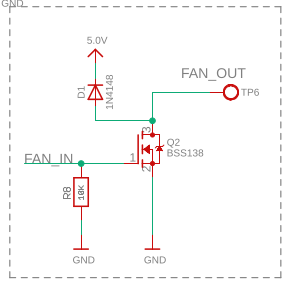
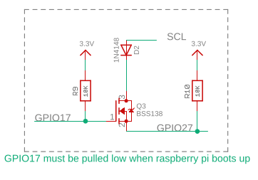
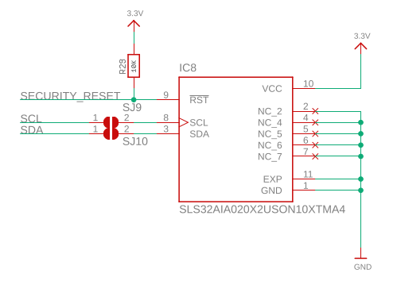

# ubo-pcb
This repo contains top and side PCB schematic and layout as well as documentation for each PCB function 

## LCD
back light
link to datasheet
pins

## Keypad

You can access the datasheet for GPIO Expander [here](datasheets/AW9523_GPIO_expander.pdf)

## RGB LED Ring

## Audio
### Speakers
### Line Out
### Microphones

## Temperature sensor

## Light Sensor

## EEPROM

## Fan

## Power Button

## Security

## Experimental SDR

