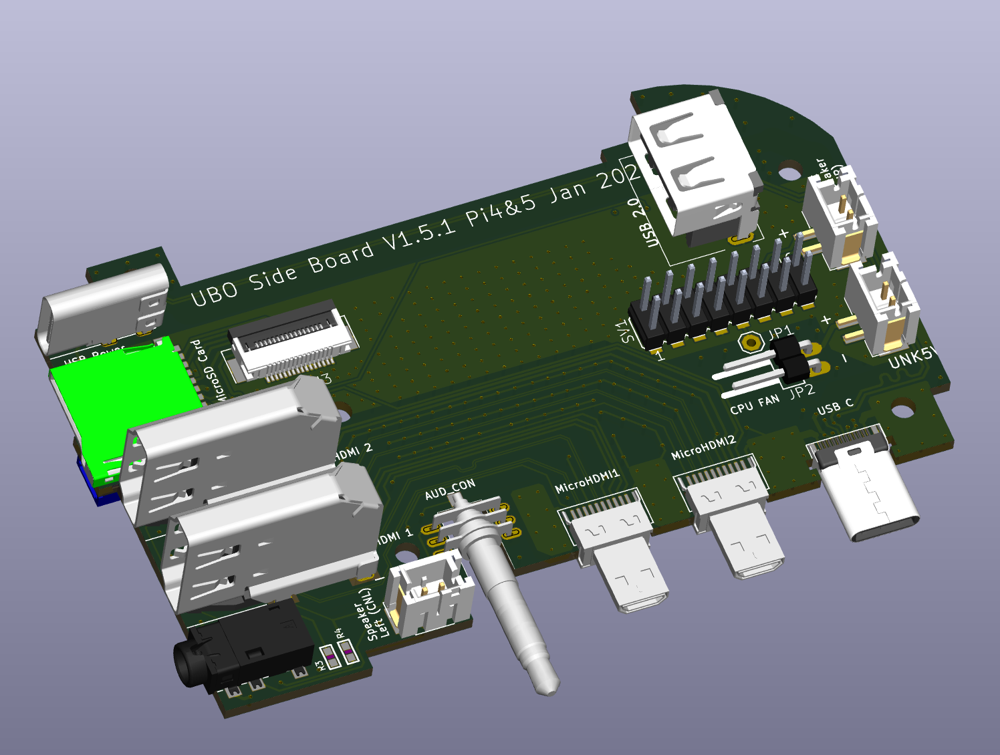
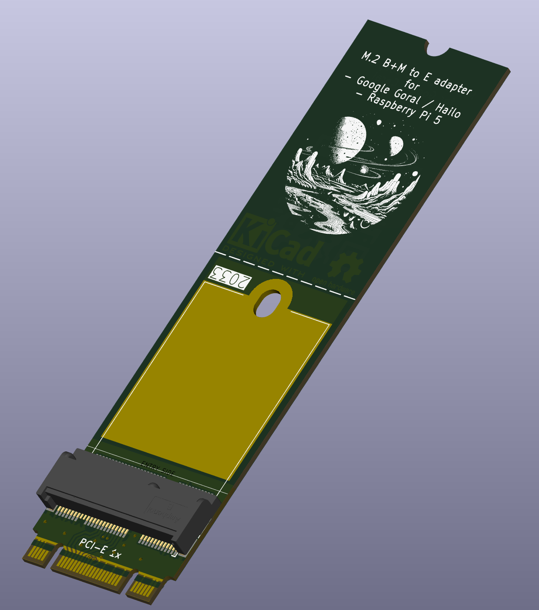
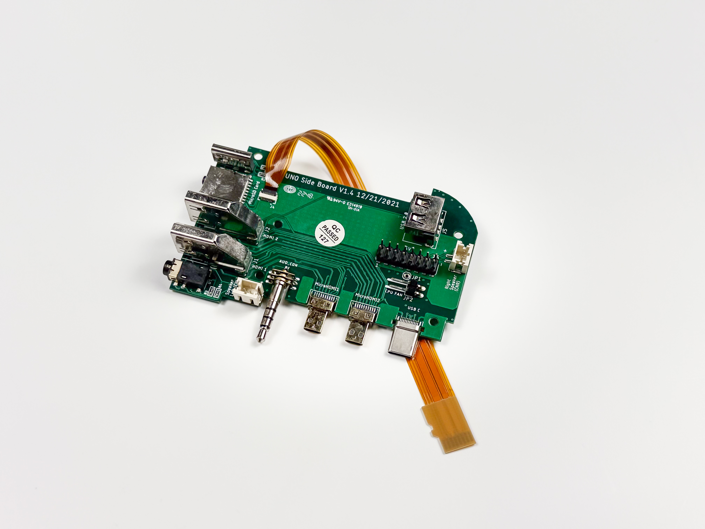

# Ubo PCBs

<p align="center">
  
</p>

Open hardware design files for the printed circuit boards in the [Ubo Pod](https://getubo.com)
and its accessories — the main Raspberry Pi HAT, the side connector board, PCIe and M.2
adapters, a flex cable, and an NFC board. Sources are a mix of **Eagle CAD** and **KiCad**;
newer designs are KiCad.

<table>
  <tr>
    <td align="center" width="33%">
      <br>
      <sub><b><a href="boards/ubo-sideboard/">Sideboard</a></b><br>ports to the back panel</sub>
    </td>
    <td align="center" width="33%">
      <br>
      <sub><b><a href="boards/ubo-hab-v2/">HAB v2</a></b><br>PCIe, USB-C PD and PoE+</sub>
    </td>
    <td align="center" width="33%">
      <br>
      <sub><b><a href="boards/ubo-pcie-adapter/">PCIe adapter</a></b><br>M.2 M-key for the Pi 5</sub>
    </td>
  </tr>
  <tr>
    <td align="center">
      <br>
      <sub><b><a href="boards/m2-mkey-to-aekey/">M.2 M-key to A/E-key</a></b><br>runs a Google Coral</sub>
    </td>
    <td align="center">
      <br>
      <sub><b><a href="boards/pcie-fpc-s-shaped/">S-shaped PCIe FPC</a></b><br>2-layer flex cable</sub>
    </td>
    <td align="center">
      <br>
      <sub><b>As fabricated</b><br>a populated sideboard</sub>
    </td>
  </tr>
</table>

## Boards

Each board lives in its own directory under [`boards/`](boards/) with its own README.

| Board | Rev | Tool | Status | Connects to |
|---|---|---|---|---|
| [**ubo-top-hat**](boards/ubo-top-hat/) | v1.6 | Eagle | Production | Raspberry Pi 40-pin header |
| [**ubo-sideboard**](boards/ubo-sideboard/) | v1.5.2 | KiCad | Current | Pi 4/5 side ports + top HAT |
| ↳ [v1.4](boards/ubo-sideboard/v1.4-eagle/) | v1.4 | Eagle | Superseded by v1.5.2 | — |
| [**ubo-hab-v2**](boards/ubo-hab-v2/) | v4 | KiCad | Current | Raspberry Pi 5 PCIe + power |
| [**ubo-pcie-adapter**](boards/ubo-pcie-adapter/) | v3 | KiCad | Superseded by HAB v2 | Raspberry Pi 5 PCIe |
| [**m2-mkey-to-aekey**](boards/m2-mkey-to-aekey/) | — | KiCad | Built and tested | M.2 M-key slot |
| [**pcie-fpc-s-shaped**](boards/pcie-fpc-s-shaped/) | v2 | KiCad | Prototype, revision in progress | PCIe adapter FPC connectors |
| [**ubo-nfc-hat**](boards/ubo-nfc-hat/) | 1.0 | KiCad | Experimental | I²C via 1×8 headers |

**What each one is:**

- **ubo-top-hat** — the main Ubo board. LCD, keypad, RGB LED ring, WM8960 audio with speakers and
  microphones, IR transmit/receive, temperature and light sensors, EEPROM, fan, power button, and
  an experimental SDR section.
- **ubo-sideboard** — brings the Pi's mini HDMI, USB-C power, and audio jack around to the back of
  the enclosure, and adds a microSD extender, STEMMA Qt connectors, a power button, and a fan header.
- **ubo-hab-v2** — "hardware added on the bottom." PCIe to M.2 M-key, with optional USB-C PD and
  PoE+ power input modules and 12V/5V/3.3V breakouts.
- **ubo-pcie-adapter** — the first HAB revision; a simpler PCIe to M.2 M-key adapter.
- **m2-mkey-to-aekey** — adapts an M.2 M-key slot to A/E-key, so a Google Coral accelerator can go
  where an NVMe drive would.
- **pcie-fpc-s-shaped** — a 2-layer S-shaped FPC cable matching the connector positions on the
  PCIe adapter.
- **ubo-nfc-hat** — NTAG I²C plus NFC tag with a chain of addressable RGB LEDs.

## Repository layout

One directory per board. Within a board directory:

```
boards/<board>/
  README.md          documentation for this board
  <design files>     KiCad project or Eagle .sch/.brd at the top level,
                     or in a <rev>-<tool>/ subdirectory when a board has
                     more than one revision (see ubo-sideboard)
  images/            renders, layout screenshots, photos
  docs/              exported schematic and assembly PDFs
  datasheets/        datasheets for the components used on this board
  mechanical/        board outline DXF, STEP and other 3D models
```

Not every board has every subdirectory — they exist where there is something to put in them.

## Opening the files

- **KiCad projects** (`.kicad_pro`) — KiCad 8 or 9. Open the `.kicad_pro`, not the individual
  schematic or board files, so the project's library tables load.
- **Eagle designs** (`.sch` / `.brd`) — authored in Eagle CAD 9.6.2. KiCad can also import them
  via *File → Import → Non-KiCad Project*.

## License

Copyright © Ubo Pod.

These designs are licensed under the **CERN Open Hardware Licence Version 2 – Strongly
Reciprocal** (`CERN-OHL-S-2.0`). The full text is in [LICENSE](LICENSE).

In plain terms:

- **You can** use, study, modify, manufacture, and sell these boards, commercially or not.
- **If you distribute a modified design**, you have to release your modified source under this
  same licence, so the next person gets what you got.
- **If you sell or give away a product** made from these designs, you have to tell the recipient
  where to obtain the source for it.
- **There is no warranty.** These are hobbyist and small-batch designs; verify them yourself
  before committing to a fabrication run.

That summary is for orientation only — [LICENSE](LICENSE) is the document that actually governs.

To reuse a board here, keep the copyright and licence notices in the design files, and note your
own changes.
