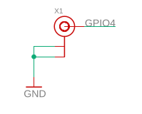

# ubo-pcb
This repo contains top and side PCB schematic and layout as well as documentation for each PCB function 

This repo contains the schematic, layout, design overview and documentations for Ubo Top PCB / Shield. The schematics and layout files are made in Eagle CAD and we plan to add KiCAD version as well.

## System Design
In designing Ubo Top PCB (HAT), we tried to use popular components that have already gained adoption among the developer community and are developer friendly. In addition, we made sure that we can source these components for manufacturing. There are several development boards with one or several of these components that you can buy from either Sparkfun, Adafruit, Tindie, SeedStudio or other vendors. At the end of this repo, we have provided links to some of the development boards as reference.

The main objective in designing Ubo was centred around improving developer and end-user experience through offering a rich user interface. Since Raspberry Pi by itself is just a compute brain with no peripherals, it is often challenging to offer a compelling UX/UI to the end user without an interface.

In the following section, we discuss how each sub-system was chosen to enhance user and developer experience as well as technical details of implementation.

## LCD
back light
link to datasheet
pins

## Keypad

You can access the datasheet for GPIO Expander [here](datasheets/AW9523_GPIO_expander.pdf)

## RGB LED Ring

## Audio
### Speakers
### Line Out
### Microphones

## Temperature sensor

## Light Sensor

## EEPROM

## Fan

## Power Button

## Security

## Experimental SDR

