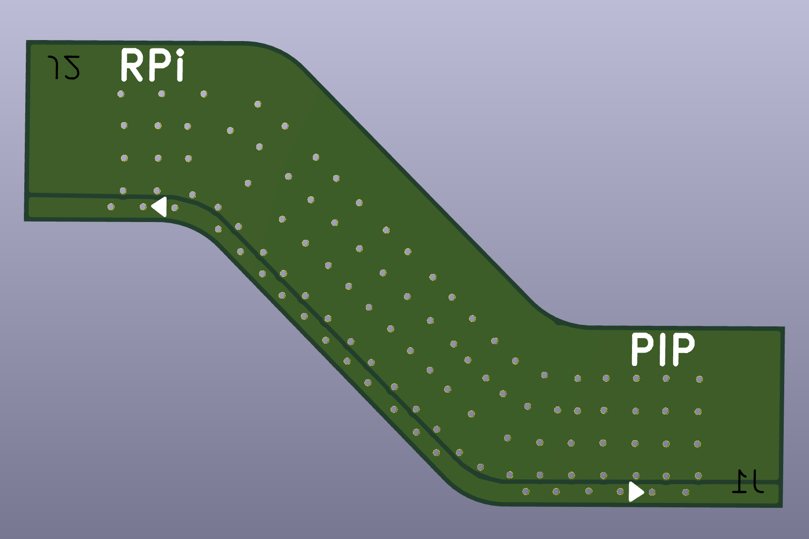
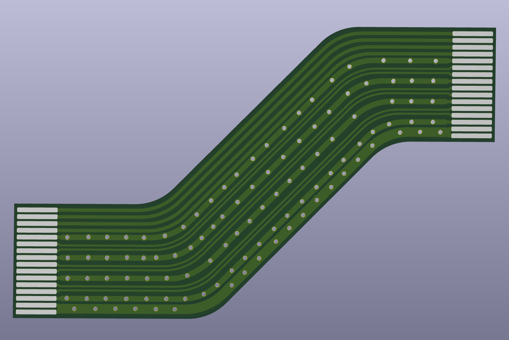

## S-Shaped FPC for PCIe adapter board

I designed this FPC cable for [my PCIe adapter board](https://github.com/ubopod/ubo-pcb/tree/main/boards/ubo-pcie-adapter) since I needed a cable that matches with the position of FPC connectors on the PCIe adapter board.

This is a 2-layer FPC cable to ensure minimal EMC radiation and shielding.

I am working on V2 of this board that incorporates several improvements.  

<table>
  <tr>
    <td></td>
    <td></td>
  </tr>
</table>
