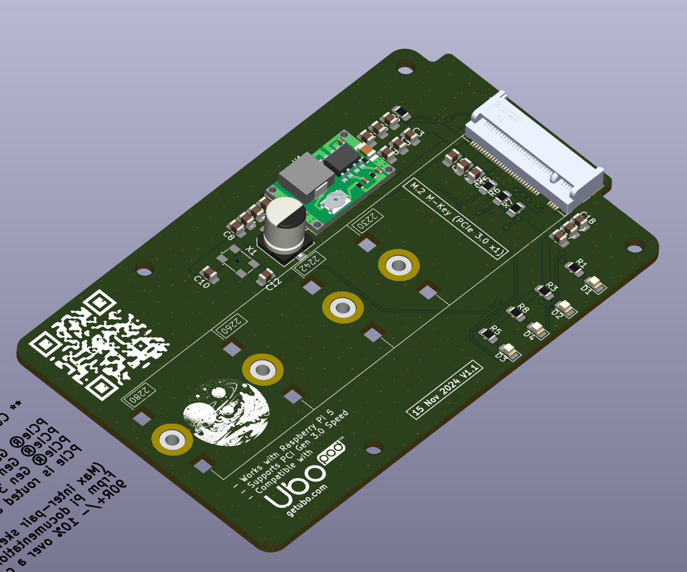
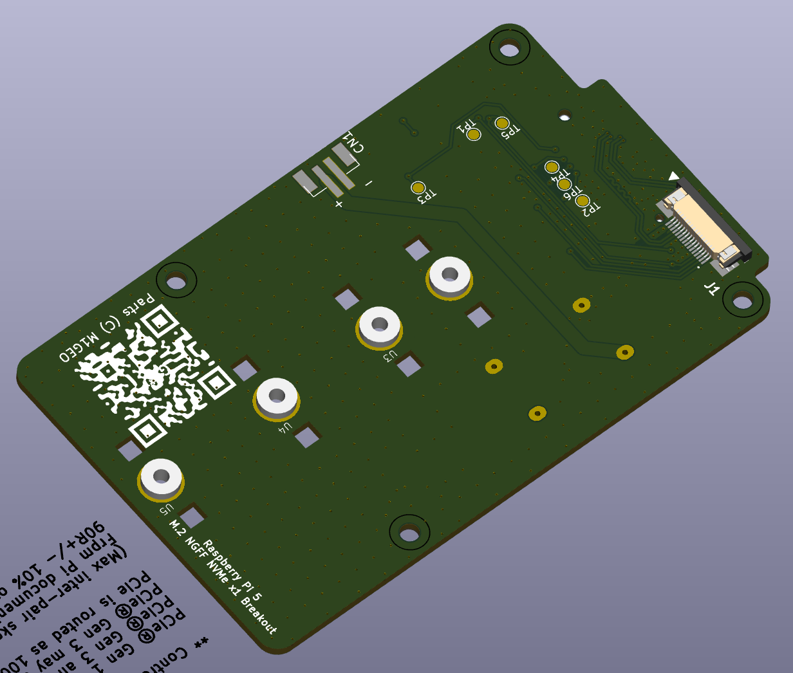
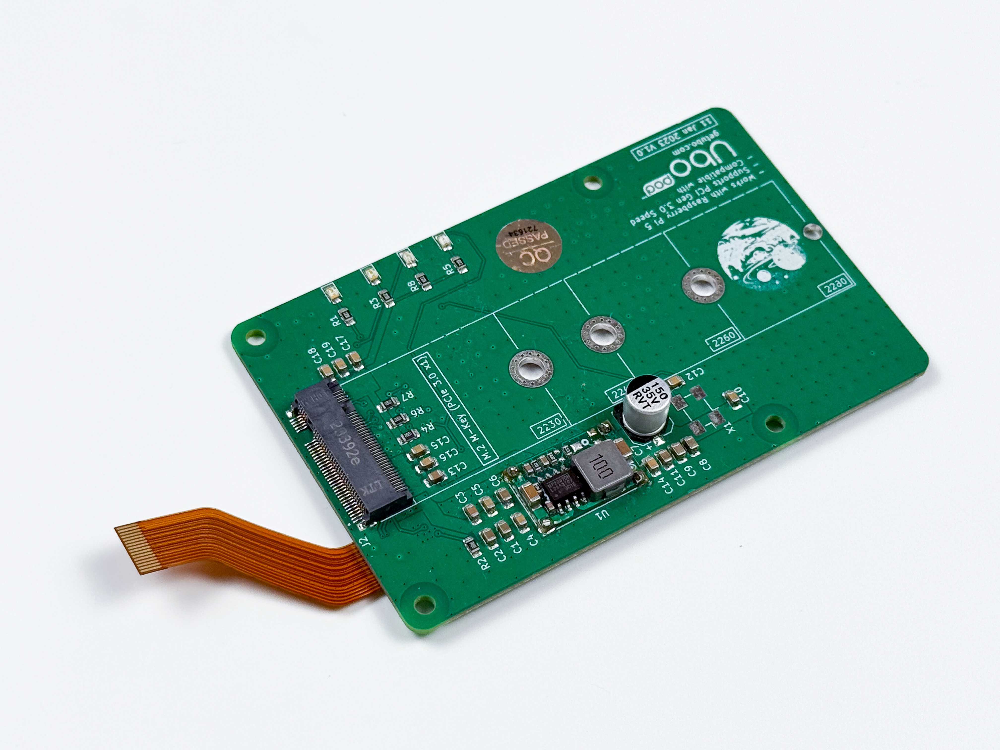
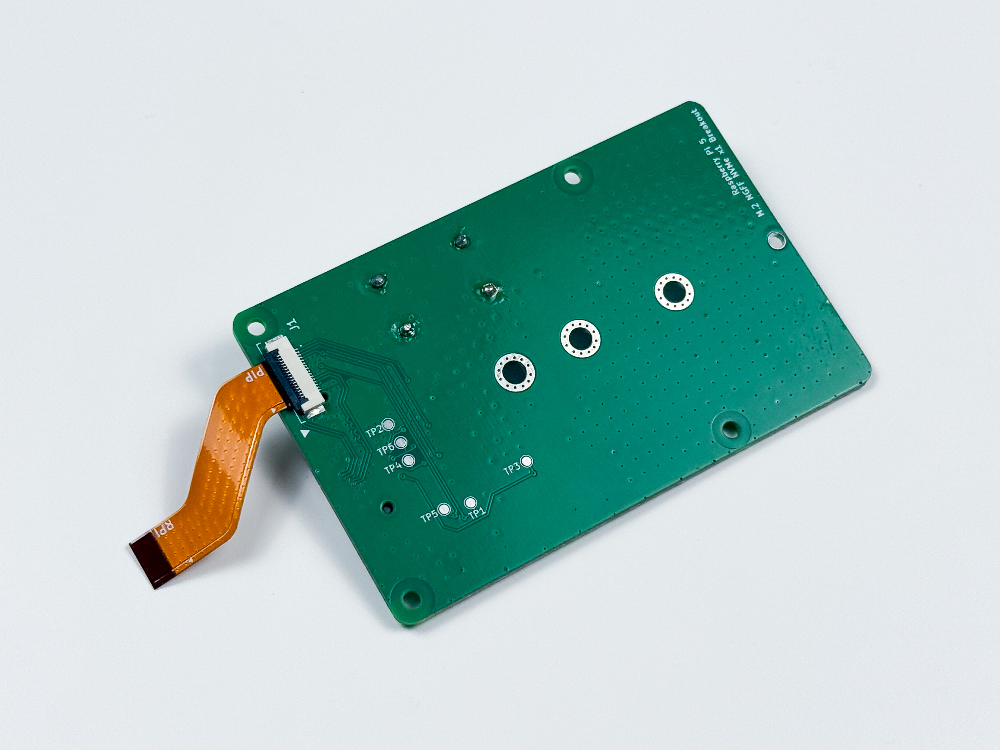

# PCIe adapter board for Raspberry Pi 5

This board adds M.2 M-key connector to Raspberry Pi 5 and is compatible with Ubo Pod enclosure. You can use this to add NVMe drives to your Ubo Pod for faster and more reliable performance.

The design was inspired and enabled by George Smart – M1GEO design who reversed engineering PCIe connections of Raspberry Pi 5 before official documentations were released:

https://github.com/m1geo/Pi5_PCIe

<table>
  <tr>
    <td></td>
    <td></td>
  </tr>
</table>

The following images for the V1 of this adapter board. 

<table>
  <tr>
    <td></td>
    <td></td>
  </tr>
</table>

This design is used in [Ubo Pod](https://getubo.com) with a custom enclosure and quick access cover to reach NVMe drive or Google Coral accelerator. 

<table>
  <tr>
    <td></td>
    <td></td>
  </tr>
</table>
