# Ubo Top HAT (Top PCB)

The main Ubo board — a Raspberry Pi HAT carrying the display, keypad, LED ring, audio, sensors, and IR.
Designed in Eagle CAD 9.6.2. See the [repository index](../../README.md) for the other boards.

| | |
|---|---|
| **Revision** | v1.6 (Eagle source) / v1.6.1 (exported schematic PDF) |
| **Tool** | Eagle CAD 9.6.2 |
| **Interface** | Raspberry Pi 40-pin header |

## Files

| Path | Contents |
|---|---|
| [`eagle/`](eagle/) | Eagle schematic and board layout (`Ubo_v1.6_led_topview.sch` / `.brd`) |
| [`docs/`](docs/) | [Full SKU schematic PDF (v1.6.1)](docs/Ubo_v1.6.1_schematic_full_SKU.pdf) |
| [`datasheets/`](datasheets/) | Datasheets for the components used below |
| [`images/`](images/) | Schematic excerpts for each sub-system |
| [`mechanical/`](mechanical/) | Board outline DXF and 3D model archive |

## Top PCB Overview

In designing Ubo Top PCB (HAT), we tried to use popular components that have already gained adoption among the developer community and are developer friendly. In addition, we made sure that we can source these components for manufacturing. There are several development boards with one or several of these components that you can buy from either Sparkfun, Adafruit, Tindie, SeedStudio or other vendors. At the end of this repo, we have provided links to some of the development boards as reference.

The main objective in designing Ubo was centred around improving developer and end-user experience through offering a rich user interface. Since Raspberry Pi by itself is just a compute brain with no peripherals, it is often challenging to offer a compelling UX/UI to the end user without an interface.

In the following section, we discuss how each sub-system was chosen to enhance user and developer experience as well as technical details of implementation.

## RASPBERRY PI HEADER

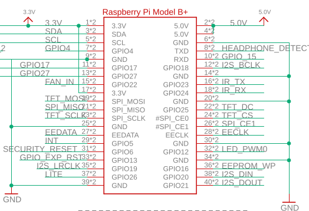

## LCD

backlight is connected to GPIO26
TODO: link to datasheet

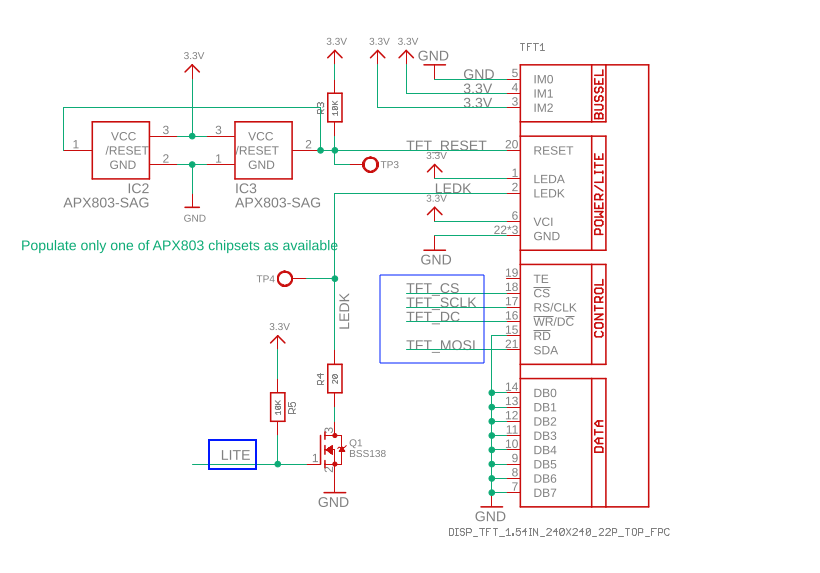

## Keypad
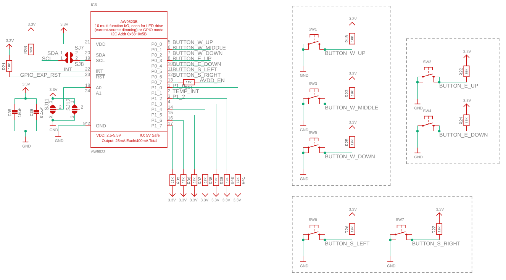

You can access the datasheet for GPIO Expander [here](datasheets/AW9523_GPIO_expander.pdf)

## RGB LED Ring

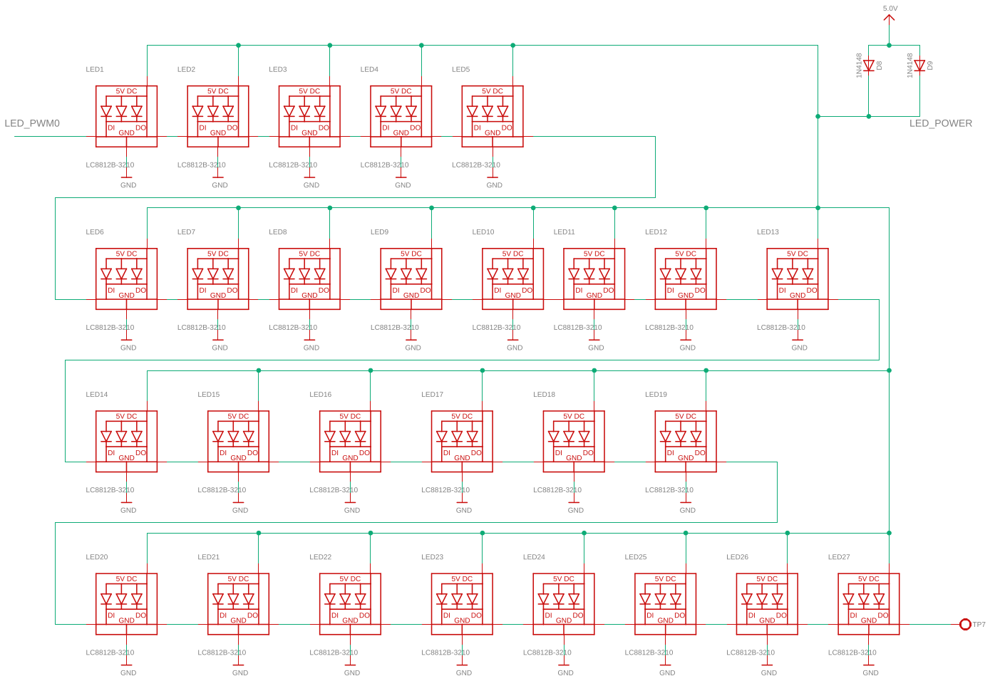

## Audio
### Speakers
### Line Out
### Microphones

## Temperature sensor
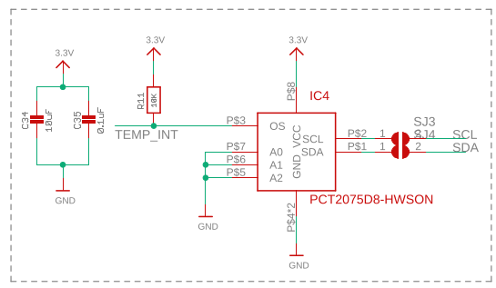

## Light Sensor
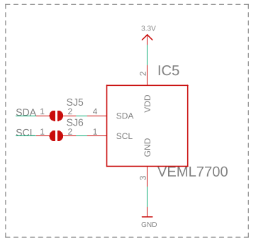

## EEPROM
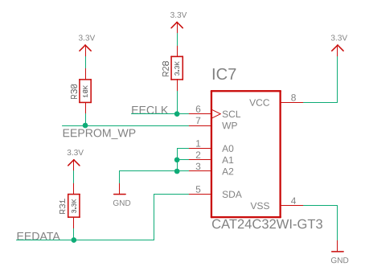

## Fan
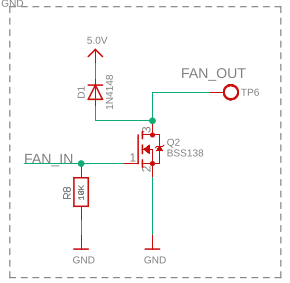

## Power Button
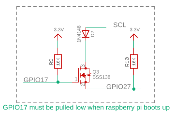

## Security
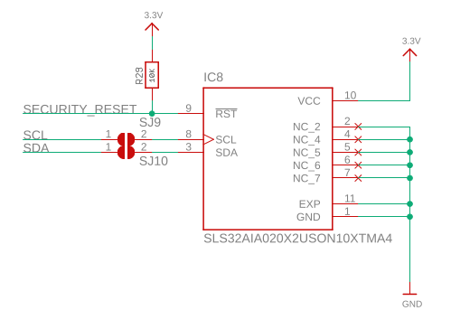

## Experimental SDR
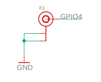

